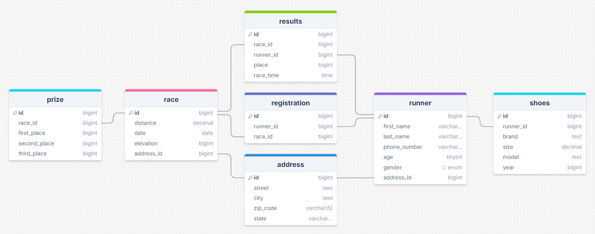

# Road races database

This database stores information about road races and runners.



## Sample queries

1) Which race has the most prize money?

```sql
SELECT race.name, (prize.first_place + prize.second_place + prize.third_place) AS total_prize_money
FROM race
JOIN prize ON race.id = prize.race_id
ORDER BY total_prize_money DESC
LIMIT 1;
```

2) Has a woman ever beat a man?
```sql
SELECT DISTINCT r1.first_name, r1.last_name
FROM results res1
JOIN runner r1 ON res1.runner_id = r1.id
JOIN results res2 ON res1.race_id = res2.race_id
JOIN runner r2 ON res2.runner_id = r2.id
WHERE r1.gender = 'Female' AND r2.gender = 'Male' AND res1.place < res2.place;
```
This query gave the correct response to the question, but my "bestResponse" method of shortening the answer caused it to misinterpet its results. It stated, "Yes, a woman named Emily beat a man named Johnson."
I didn't include the SQL query or database schema when I gave it the results, so it wasn't able to interpret them correctly in this instance. When I did do so, it performed great.

See either respones_zero_shot or response_single_domain_double_shot for other query examples.

## Prompting Strategies

In one of my queries, single domain outperformed zero shot by recommending shoes based off race distance and time, instead of just race time when I had asked it for the fastest shoe.
Other than this, though, I didn't notice much of a difference between the two strategies. Both performed well.
